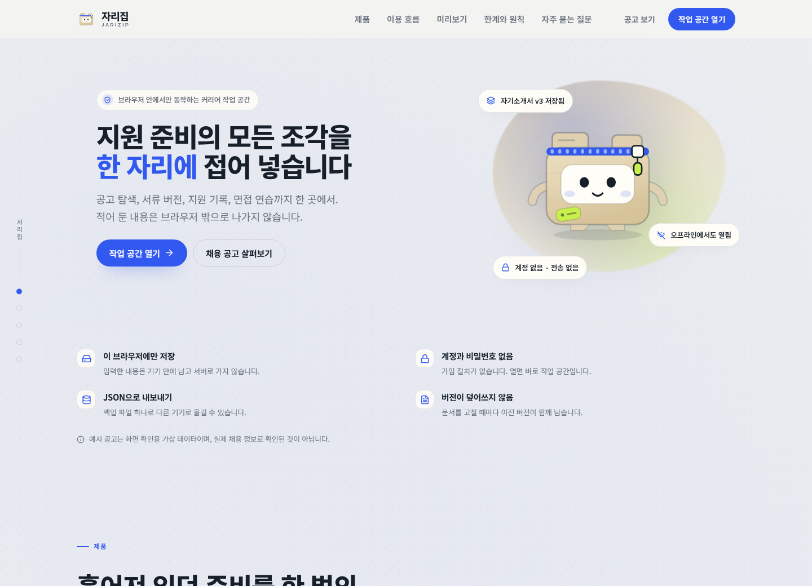
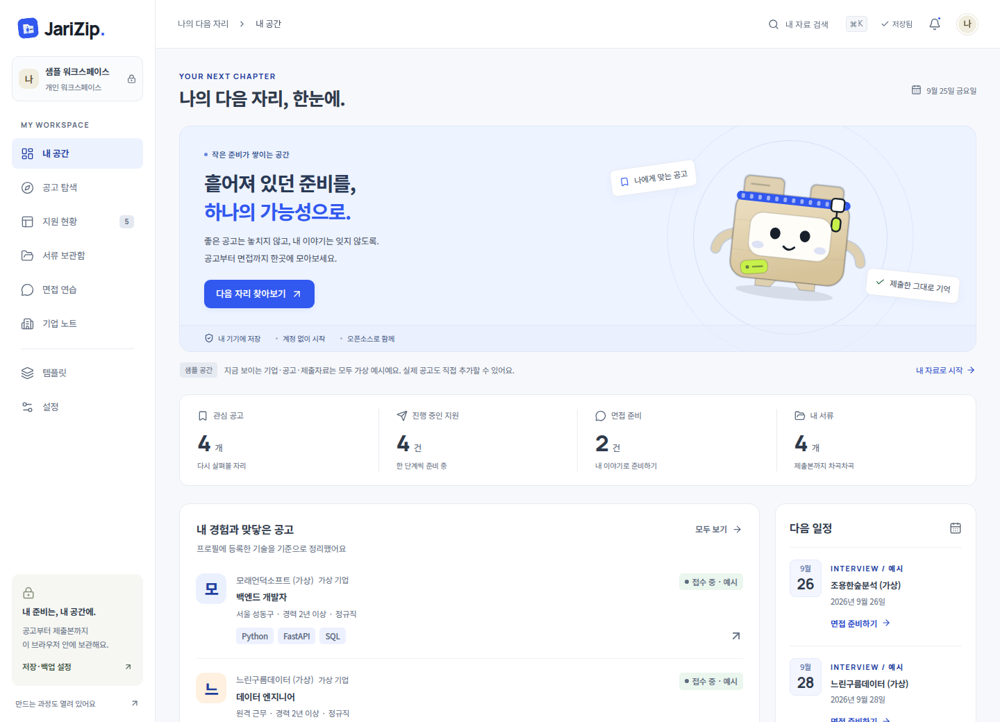
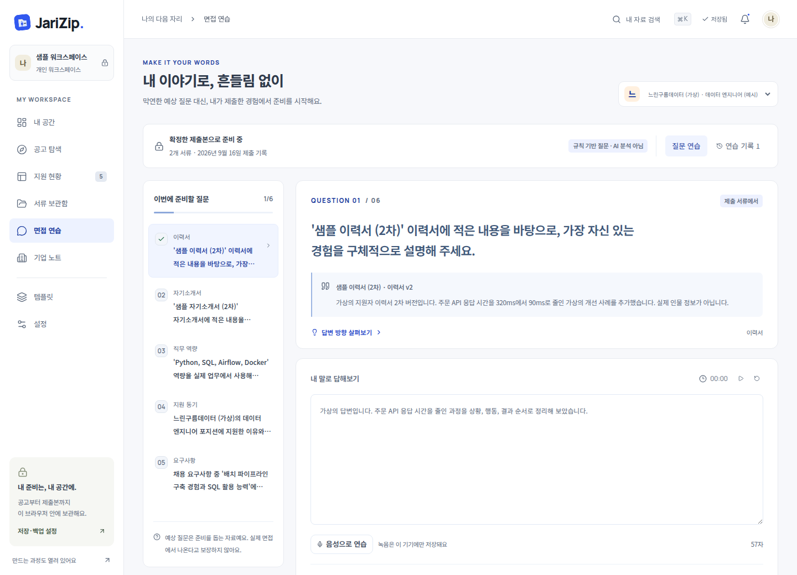

<div align="center">

# JariZip · 자리집

### 나의 다음 자리가 모이는 곳.

공고를 발견하고, 제출한 서류를 기억하고, 내 이야기로 면접을 준비하는 **한국어 로컬 우선 취업 워크스페이스**.

React · TypeScript · IndexedDB · Open source

</div>

---



<details>
<summary><strong>실제로 동작하는 워크스페이스 화면 보기</strong></summary>

### 내 공간


### 공고 탐색


### 제출본 기반 면접 연습


[전체 화면 캡처](docs/preview) · [검증 기록](docs/verification.md)

</details>

## 지금 사용할 수 있는 것

자리집은 설명용 이미지가 아닌, 브라우저에서 동작하는 제품 프로토타입입니다. 계정 없이 가상 예시로 살펴본 뒤, 빈 공간에 자신의 자료를 넣어 사용할 수 있습니다.

| 공간 | 실제 동작 |
| --- | --- |
| 제품 소개 | 오리지널 캐릭터 **지피**, 포인터 반응, 지퍼 클릭, 스크롤 이야기, 조작 가능한 미니 데모, FAQ |
| 내 공간 | 보관 자료에서 계산한 현황, 등록 기술 기준 공고 정렬, 직접 입력한 면접 일정, 최근 7일 지원 목표 |
| 공고 탐색 | 검색·직무·지역·접수 상태 필터, 관심 공고, 게시일·마감일 정렬, 링크와 본문 직접 저장, 접수 상태 직접 기록 |
| 지원 현황 | 단계별 보드·목록, 드래그 또는 메뉴로 단계 이동, 준비 메모, 면접 일정, 지원 당시 공고 스냅샷 |
| 서류 보관함 | PDF·DOCX·TXT·MD 업로드, 원본 보관, 텍스트 추출·미리 보기, 편집 시 새 버전, 버전별 다운로드, 인쇄·PDF 저장 |
| 제출본 보관 | 회사별 **실제로 제출한 버전**을 선택하고 확정. 이후 이력서를 수정해도 이전 제출본은 그대로 유지 |
| 면접 연습 | 확정한 제출본과 공고를 근거로 한 규칙 기반 질문, 근거 문장·버전 표시, 답변 가이드, 타이머, 글·음성 답변, 자기 점검·연습 기록 |
| 기업 노트 | 직접 조사한 메모와 공고 속 정보 구분, 질문 틀, 회사별 보관 공고 |
| 템플릿 | 한국어 이력서·자기소개서·경력기술서·포트폴리오 틀, 미리 보기, 직접 편집 후 보관 |
| 설정·백업 | 프로필·관심 기술·제외 키워드·목표, 원본 파일과 녹음을 포함한 JSON 백업·검사 후 복원, 명시적인 초기화 |

### 아직 연결하지 않은 것

**실시간 채용공고 수집, 외부 사이트 자동 접수 확인, LLM 자기소개서 생성·면접 평가, 클라우드 동기화, 자동 지원 전송은 구현되어 있지 않습니다.** 현재의 면접 질문과 기술 비교는 로컬 규칙 기반입니다. AI 결과나 합격 가능성으로 표시하지 않습니다.

모든 기본 기업·공고·서류는 가상 예시입니다. 실제 채용 중인 공고처럼 표시하지 않으며, 직접 추가한 공고도 처음에는 `미확인`입니다. 게시일이 없는 공고에 저장 날짜를 게시일로 대신 넣지 않습니다. 사용자가 직접 확인한 상태에는 확인 일시와 수동 확인 표시가 붙습니다. 마감일이 지난 공고는 화면에서 마감으로 표시합니다.

## 시작하기

Node.js **22.12 이상**과 npm이 필요합니다. 실제 검증 환경은 Linux/WSL의 Node.js 22.22.2입니다.

```bash
git clone https://github.com/Blue-B/JariZip.git
cd JariZip
npm ci
npm run dev
```

브라우저에서 `http://localhost:5173`을 엽니다. 첫 방문에는 예시 워크스페이스가 만들어집니다. **설정 → 비우고 내 자료로 시작**으로 예시를 지울 수 있습니다. 이 작업은 이미 입력한 자료도 지우므로 먼저 백업하세요.

배포용 결과물을 확인하려면:

```bash
npm run build
npm run preview
```

미리 보기 주소는 `http://localhost:4178`입니다. 이미 다른 프로그램이 이 포트를 쓰고 있다면 해당 프로그램을 중지하지 말고 다른 포트를 지정하세요.

```bash
npm run preview -- --port 4180
```

Linux/WSL에는 이 프로젝트의 미리 보기만 별도로 실행·중지하는 보조 스크립트도 있습니다. 로그와 PID는 Git에서 제외된 `.local/`에 생성됩니다.

```bash
npm run preview:start
npm run preview:stop
```

## 가장 중요한 흐름

1. **공고 저장**: 원본 링크, 실제 게시일을 아는 경우 게시일, 본문을 입력합니다.
2. **서류 준비**: 기존 파일을 넣거나 템플릿을 편집합니다. 수정은 새 버전으로 쌓입니다.
3. **지원 기록**: 공고에서 지원 준비를 시작하고, 실제 제출한 파일 버전을 선택해 확정합니다. 자리집은 기업에 지원서를 보내지 않습니다.
4. **면접 준비**: 최신 작업 파일이 아니라, 그 지원 건의 최근 확정 제출본으로 연습합니다. 입력한 답변은 저장 버튼으로 보관합니다.

제출 기록에 연결된 서류의 전체 삭제는 제한됩니다. 지원 기록을 삭제하면 그 지원에 연결된 연습 답변도 삭제되지만, 보관함의 원본 서류와 공고는 남습니다.

## 개인정보와 저장 방식

- 이력서, 공고 원문, 메모, 녹음은 **현재 브라우저의 IndexedDB**에 보관됩니다. 서버와 분석 서비스로 전송하지 않습니다. 웹 폰트도 앱과 함께 제공되며 외부 폰트 서버에 요청하지 않습니다.
- 브라우저 데이터를 지우거나 다른 브라우저·기기·주소로 접속하면 같은 자료가 보이지 않습니다. `localhost`와 `127.0.0.1`도 서로 다른 저장 공간이므로 한 주소를 꾸준히 사용하세요.
- 브라우저 저장소와 백업 파일은 **암호화 보관함이 아닙니다**. 공용 기기에는 개인정보를 넣지 마세요. JSON 백업에는 원본 서류와 음성도 포함되므로 안전하게 보관하세요.
- 저장 불가·용량 부족·손상된 데이터가 감지되면 정상 저장으로 표시하지 않습니다. 읽지 못한 기존 데이터는 조용히 덮어쓰지 않고 별도 보관합니다.
- 가져올 백업의 형식, 크기, ID·버전·제출본 연결, URL, 파일 데이터 형식을 검사합니다. 복원은 병합이 아니라 **전체 교체**이며 확인이 필요합니다.
- 외부 원문 링크는 사용자가 누를 때만 해당 사이트로 이동합니다. 링크를 열었다는 사실만으로 접수 중으로 판정하지 않습니다.

### 파일·녹음 제한

문서 1개당 최대 **6MB**, 한 번에 5개까지 업로드할 수 있습니다. PDF는 텍스트 레이어를 읽으며 최대 60페이지를 처리합니다. 이미지로만 된 스캔 PDF의 OCR은 제공하지 않습니다. 미리 보기는 추출한 텍스트이므로 원본의 표·이미지·레이아웃과 다를 수 있습니다. HWP/HWPX는 지원하지 않으므로 PDF 또는 DOCX로 변환해주세요.

음성 연습은 명시적으로 버튼을 눌러 마이크 권한을 허용한 후 시작합니다. 최대 **2분** 녹음하며, 화면을 나가면 녹음을 종료합니다. 녹음 결과는 답변 저장을 눌러야 보관됩니다. 음성 전사는 연결되어 있지 않습니다. 브라우저별 녹음 지원이 다르며 HTTPS 또는 localhost 같은 안전한 환경이 필요합니다.

전체 백업 가져오기는 최대 **40MB**입니다. 원본 파일은 Base64로 보관하므로 실제 파일보다 저장 공간을 더 사용합니다. 브라우저 저장 용량은 기기마다 다릅니다.

## 개발과 검증

```bash
npm run typecheck
npm test
npm run build

# 브라우저 통합 테스트: 사용자 프로필·실제 마이크를 사용하지 않습니다.
npx playwright install chromium
npm run test:e2e
```

통합 테스트는 분리된 임시 브라우저 공간과 합성 오디오 장치를 사용합니다. 랜딩 상호작용, 모바일 화면, 수동 공고 상태, 원본 업로드, 정확한 제출 버전 유지, 답변 저장, 백업 복원, 잘못된 백업 거부, 중첩 창의 스크롤 복원 등을 확인합니다.

```text
src/
  components/          캐릭터, 대화상자, 서류 편집·미리 보기
  lib/                 데이터 구조, 저장, 검증, 파일 처리, 예시, 녹음
  pages/Landing.tsx    제품 소개와 인터랙티브 미니 데모
  pages/Workspace.tsx  앱 공통 구조와 탐색
  pages/workspace/     8개 실제 작업 화면
  styles/             소개 페이지와 작업 화면을 분리한 스타일
scripts/               미리 보기, 화면 캡처, 저장 진단
tests/e2e/             실제 브라우저 통합 테스트
```

## 배포

`npm run build`로 생성된 `dist/`를 정적 웹 호스팅에 배포할 수 있습니다. 상대 자산 경로와 HashRouter를 사용하므로 하위 경로에서도 별도 페이지 재작성 규칙 없이 실행할 수 있습니다. 자동 배포 워크플로, 공개 도메인, 서버 API는 기본으로 설정하지 않습니다.

## 디자인과 기여

지피와 종이·폴더 일러스트는 이 프로젝트를 위해 직접 작성한 SVG/CSS입니다. 다른 사이트의 캐릭터나 이미지를 가져오지 않았습니다. 움직임 최소화 설정, 키보드 조작, 작은 화면을 고려했습니다. 제품 소개의 미니 데모는 체험용이며 새로고침하면 초기화됩니다. 실제 자료는 **내 공간**에서 관리하세요.

버그 제보에는 브라우저와 재현 방법을 남겨주세요. 이력서, 이메일 주소, API 키, 실제 지원 내역이나 다른 사람의 개인정보는 공개 이슈와 예시 데이터에 포함하지 마세요.

## License

MIT. 각 의존성의 라이선스는 해당 패키지를 따릅니다.
