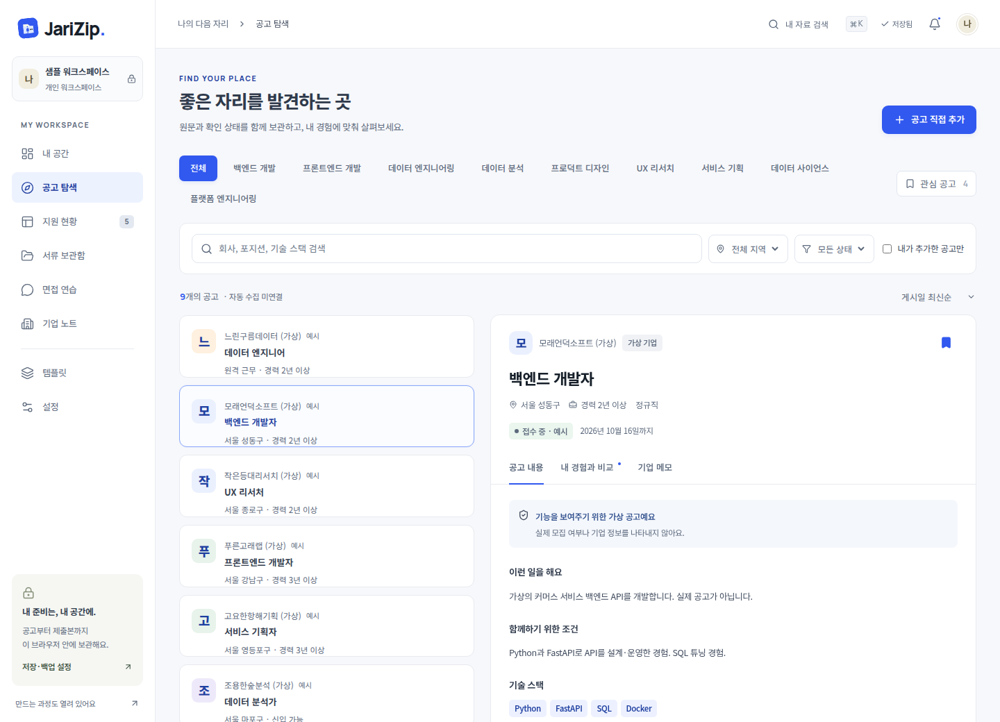
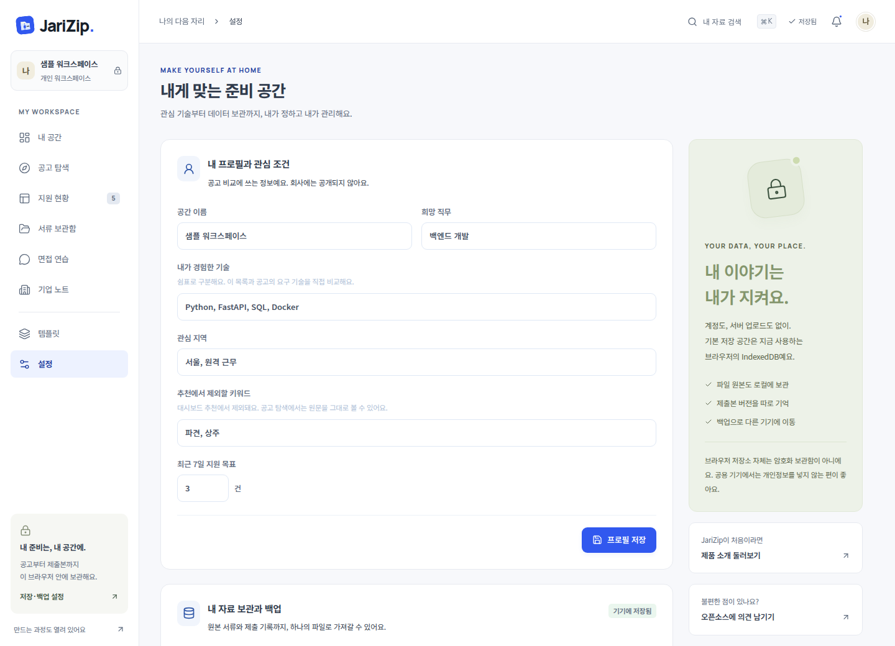
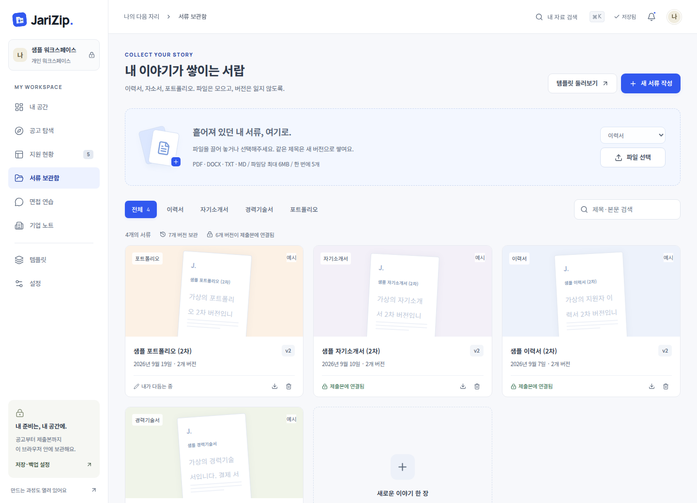
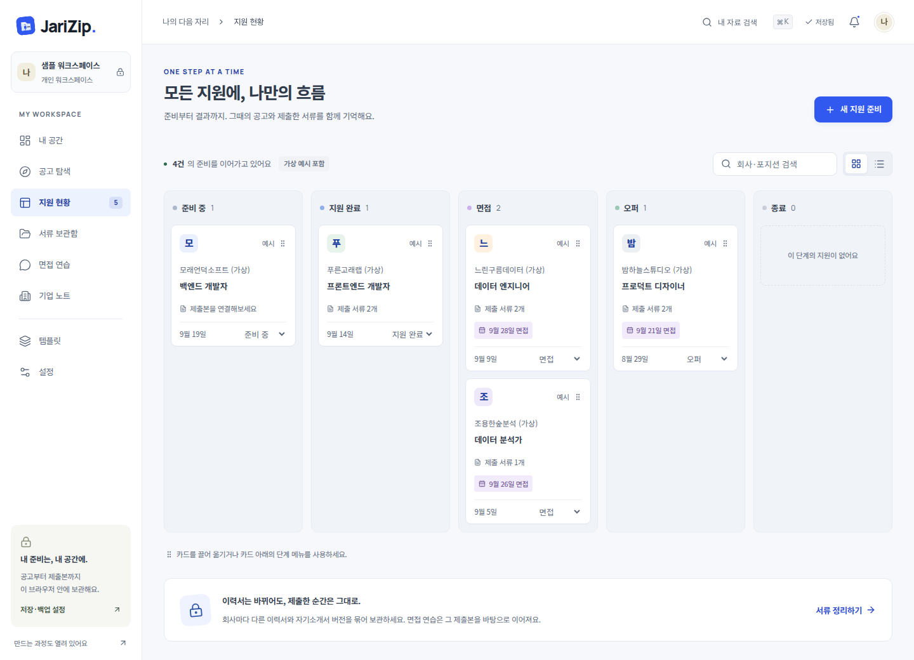

# JariZip · 자리집


**채용공고, 실제 제출한 서류 버전, 지원 현황과 면접 준비를 내 PC에 모아두는 로컬 취업 기록 도구.**

<p align="center"></p>

## 가장 쉬운 사용 방법

일반 사용자에게는 **Windows 데스크톱 앱** 사용을 권장합니다. Node.js나 터미널을 직접 다룰 필요 없이 앱 안에서 설정하도록 구성되어 있습니다.

> Windows에서는 [v0.1.0 Beta의 포터블 EXE](https://github.com/Blue-B/JariZip/releases/tag/v0.1.0)를 내려받아 설치 없이 바로 실행할 수 있습니다.

처음 실행하면 **공고 연결 마법사**가 열립니다.

1. **고용24·사람인·조블 중 선택**
2. 앱에서 공식 API 발급 안내 페이지 열기
3. 발급받은 개인 API 키 붙여넣기
4. **저장하고 연결 확인** 클릭
5. 실제 공고 조회가 확인되면 바로 채용 탐색 시작

API 키는 GitHub 저장소나 브라우저 저장소에 남기지 않고, 데스크톱 앱에서 운영체제 보안 저장소를 이용해 암호화해 보관합니다. 연결을 원하지 않으면 건너뛰고 공고를 직접 추가할 수도 있습니다.

| 공고 연결 | 서류 보관 | 지원 기록 |
| --- | --- | --- |
|  |  |  |

## 지원하는 채용 출처

| 출처 | 자동 검색 | 필요한 것 |
| --- | --- | --- |
| **고용24** | 지원 | 본인이 발급받은 `WORK24_AUTH_KEY` |
| **사람인** | 지원 | 본인이 발급받은 `SARAMIN_ACCESS_KEY` |
| **조블** | 지원 (목록 검색) | 본인이 발급받은 `JOOBLE_API_KEY` |
| 원티드 | 자동조회 미지원 | 원문 링크를 직접 열어 기록 |
| 점핏 | 자동조회 미지원 | 원문 링크를 직접 열어 기록 |
| 직행 | 자동조회 미지원 | 원문 링크를 직접 열어 기록 |

**원티드·점핏·직행은 API 키 없이 자동 조회되는 출처가 아닙니다.** 현재 JariZip에서 사용 권한이 확인된 공식 자동조회 API가 없어 자동 조회와 키 설정을 제공하지 않습니다. 원문 링크를 직접 열어 공고를 기록해주세요. 공식 API 사용 권한이 확인된 고용24·사람인·조블만 개인 키로 연결합니다.

공식 안내: [고용24 Open API](https://www.work24.go.kr/cm/e/a/0110/selectOpenApiIntro.do) · [사람인 API](https://oapi.saramin.co.kr/guide/info) · [조블 API](https://kr.jooble.org/api/about)

## 할 수 있는 일

- 실제 채용공고 검색·보관 또는 공고 직접 추가
- 지원 단계 관리
- 이력서·자기소개서·경력기술서·포트폴리오 보관
- 서류 수정 시 **새 버전으로 보존**
- 지원 당시 사용한 공고와 제출 서류 버전 고정
- 면접 질문·답변·연습 녹음 기록
- 기업별 메모
- 전체 자료 JSON 백업·복원

기업에 지원서를 자동 제출하거나 합격 확률을 계산하지 않습니다.

## 내 자료는 어디에 저장되나요?

서류, 공고, 지원 기록, 메모와 녹음은 **현재 PC의 JariZip 로컬 저장소**에 보관됩니다. 계정이나 중앙 사용자 DB는 없습니다.

- 브라우저/앱 데이터를 지우면 자료가 없어질 수 있으므로 정기적으로 백업하세요.
- 전체 백업은 40MB까지 지원합니다.
- 백업 파일에는 서류 원본과 녹음이 포함될 수 있으며 암호화 파일은 아닙니다.
- 여러 창에서 동시에 수정하면 오래된 창이 최신 자료를 덮어쓰지 않도록 충돌을 감지합니다.

## 개발자용 실행

데스크톱 앱 없이 기존 로컬 웹 모드로도 사용할 수 있습니다.

```bash
npm ci
npm run build
npm start
```

브라우저에서 `http://localhost:4178/`을 엽니다. 이 모드에서는 **내 설정 → 공고 연결**의 출처 목록에서 고용24·사람인 키를 붙여넣어 설정하고 바로 조회를 확인할 수 있어요. 키를 처음 설정하면 **키 설정**, 이미 설정되어 있으면 **키 변경**, 필요 없으면 **키 삭제**를 사용합니다. 저장한 키는 서버가 필요한 경우 프로젝트의 `.env.local`에 보관하며, 파일을 직접 고치지 않아도 재시작 없이 즉시 반영됩니다. 키 값은 화면·로그·URL로 다시 전달되지 않고, 설정 여부만 참/거짓으로 표시됩니다.

`.env.local`을 직접 관리하고 싶다면 다음 두 변수를 채워 넣어도 됩니다.

```env
WORK24_AUTH_KEY=
SARAMIN_ACCESS_KEY=
JOOBLE_API_KEY=
```

데스크톱 개발/패키징:

```bash
npm run desktop          # Electron 앱 실행
npm run desktop:smoke    # 데스크톱 통합 검사
npm run package:win             # Windows portable EXE (권장)
npm run package:win:installer   # Windows 설치형 EXE (Windows/Wine 빌드 환경 필요)
npm run package:linux           # Linux 검증용 패키지
```

현재 기술 구성은 React + TypeScript + Vite, Node.js `node:http`, Electron, IndexedDB, PDF.js, Mammoth, Zod입니다. Redis·Kafka·PostgreSQL 같은 별도 서버 인프라는 로컬 앱에 필요하지 않아 사용하지 않습니다.

자세한 데스크톱 구조와 보안 경계는 [docs/desktop-app.md](docs/desktop-app.md)를 참고하세요.

## 라이선스

MIT. 소스코드 라이선스는 외부 채용공고의 수집·복제·재배포 권한을 의미하지 않습니다.
