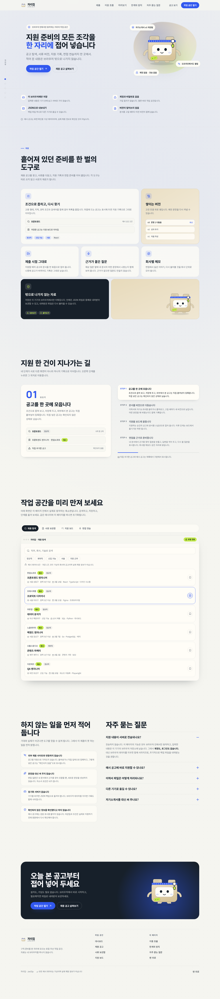
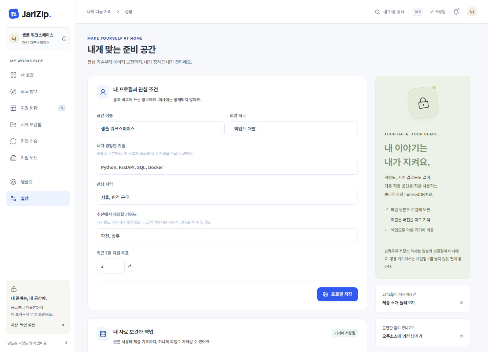
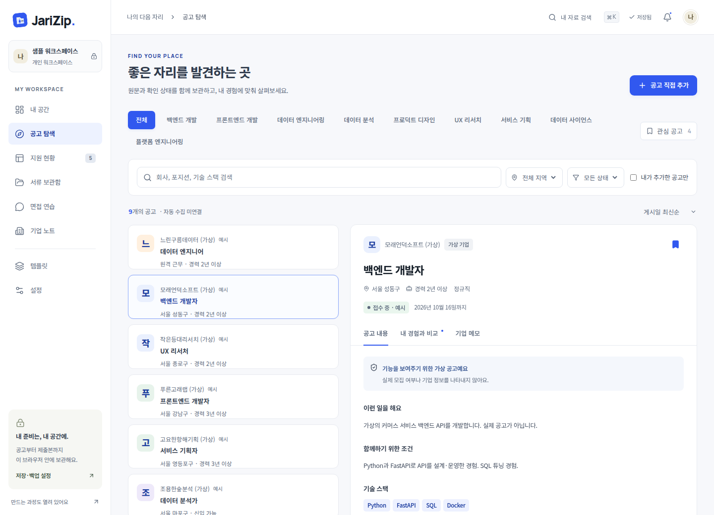
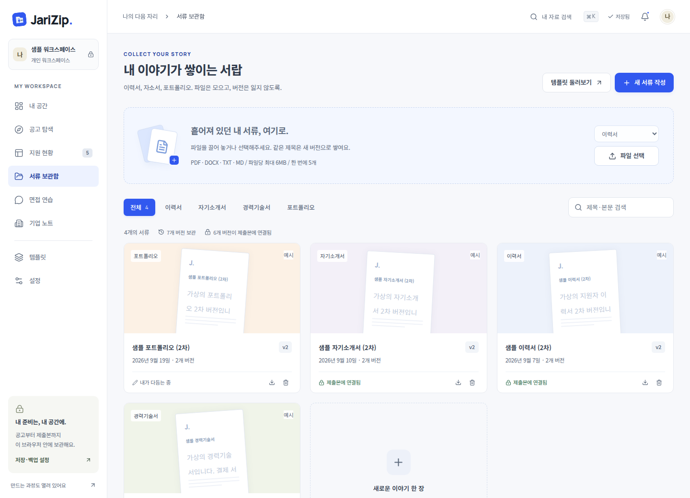
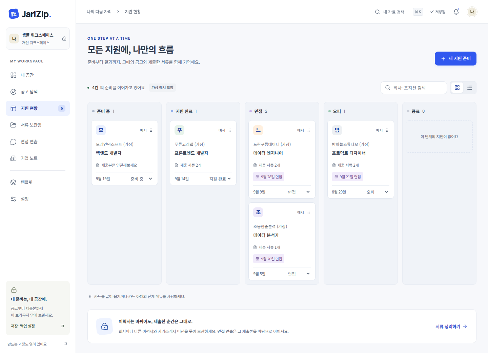

# JariZip 처음 사용하기

개발 지식이 없어도 순서대로 따라갈 수 있도록 정리한 시작 안내입니다.

> 화면 예시는 기능 설명을 위한 가상 데이터가 포함될 수 있습니다. 실제 설치에서는 가상 공고·서류·지원 기록을 자동으로 만들지 않습니다.

## 1. JariZip은 무엇을 하나요?

JariZip은 채용공고, 실제로 제출한 서류 버전, 지원 상태, 면접 준비 기록을 한곳에서 관리하는 로컬 취업 도구입니다.



- 내 이력서·자기소개서·녹음은 현재 브라우저에 저장됩니다.
- 기업에 지원서를 자동 제출하지 않습니다.
- 공식 API를 연결하면 지원되는 채용 사이트의 실제 공고를 검색할 수 있습니다.
- API를 연결하지 않아도 공고 링크를 직접 추가해 기록할 수 있습니다.

## 2. 가장 쉬운 실행 방법

현재 베타는 Node.js 22.12 이상이 필요합니다. 설치형 앱은 아직 제공하지 않습니다.

### Windows

1. 이 저장소를 ZIP으로 내려받아 압축을 풉니다.
2. Node.js 22.12 이상을 설치합니다.
3. 폴더 안의 `start-jarizip.cmd`를 실행합니다.
4. 브라우저에서 `http://localhost:4178/`을 엽니다.
5. 사용하는 동안 열린 터미널 창은 닫지 않습니다.

### macOS / Linux

터미널에서 프로젝트 폴더를 연 뒤 아래 명령을 실행합니다.

```bash
sh start-jarizip.sh
```

종료할 때는 터미널에서 `Ctrl+C`를 누릅니다.

## 3. 실제 채용공고 연결하기

현재 자동 검색을 지원하는 공식 출처는 **고용24**와 **사람인**입니다.



### 고용24

1. [고용24 Open API](https://www.work24.go.kr/cm/e/a/0110/selectOpenApiIntro.do)에서 이용 신청을 합니다.
2. 승인 후 본인 인증키를 발급받습니다.
3. 프로젝트의 `.env.example`을 복사해 `.env.local` 파일을 만듭니다.
4. 아래처럼 본인 키를 입력합니다.

```env
WORK24_AUTH_KEY=내_고용24_인증키
```

5. JariZip을 다시 실행합니다.
6. **설정 → 공고 연결 → 고용24 → 공고 조회 확인**에서 연결 상태를 확인합니다.

### 사람인

사람인 API 이용 승인을 받고 access-key를 발급받은 경우 같은 방식으로 입력합니다.

```env
SARAMIN_ACCESS_KEY=내_사람인_access_key
```

API 키는 GitHub에 올리거나 다른 사람과 공유하지 마세요.

## 4. 공고 찾고 저장하기

채용 탐색에서 키워드·지역·직무·경력 조건으로 검색합니다. 공식 API를 연결하지 않았다면 원문 사이트를 열어 확인한 뒤 직접 공고를 추가할 수 있습니다.



공고를 보관하면 이후 지원 기록과 연결할 수 있습니다. 지원 전에는 반드시 원문에서 모집 상태와 마감 시각을 다시 확인하세요.

## 5. 서류 보관하기

이력서·자기소개서·경력기술서·포트폴리오를 보관할 수 있습니다. 서류를 수정하면 기존 파일을 덮어쓰지 않고 새 버전으로 남깁니다.



지원 기록에서 특정 버전을 제출본으로 지정하면 나중에 서류를 수정해도 그때 제출한 버전은 그대로 유지됩니다.

## 6. 지원 진행 상황 기록하기

지원한 공고는 준비 중, 지원 완료, 면접, 오퍼, 종료 단계로 관리할 수 있습니다.



JariZip의 지원 상태는 사용자가 기록하는 개인 메모입니다. 기업 채용 시스템과 자동 동기화되지 않습니다.

## 7. 백업하기

자료는 서버 계정이 아니라 현재 브라우저에 저장됩니다. 브라우저 데이터를 지우면 기록도 사라질 수 있습니다.

중요한 자료를 넣었다면 **설정 → 전체 백업 내려받기**를 사용하세요.

- 전체 JSON 백업은 40MB까지 지원합니다.
- 백업 파일에는 원본 서류와 녹음이 포함될 수 있습니다.
- 백업은 암호화되지 않으므로 공개 저장소나 이슈에 올리지 마세요.
- 여러 탭에서 동시에 수정하면 JariZip이 충돌을 감지하고 덮어쓰지 않도록 안내합니다.

## 자주 막히는 부분

**공고가 하나도 안 보여요.**  
고용24 또는 사람인 공식 API 키가 연결되어 있는지 설정에서 확인하세요. 키가 없어도 공고 URL을 직접 추가해 나머지 기능은 사용할 수 있습니다.

**브라우저를 껐다 켜도 자료가 남나요?**  
같은 브라우저·프로필·주소(`http://localhost:4178/`)를 사용하면 IndexedDB에 저장된 자료를 다시 읽습니다.

**다른 PC에서 같은 자료를 보고 싶어요.**  
현재 자동 동기화는 없습니다. 설정에서 백업 파일을 내려받고 다른 PC에서 불러오세요.

**GitHub Pages 주소에서 바로 사용할 수 있나요?**  
현재 JariZip은 공식 채용 API를 호출하는 로컬 Node 서버가 필요하므로 GitHub Pages만으로 전체 기능을 제공하지 않습니다.

더 자세한 기술·운영 범위는 [로컬 배포 안내](local-release.md)를 참고하세요.
